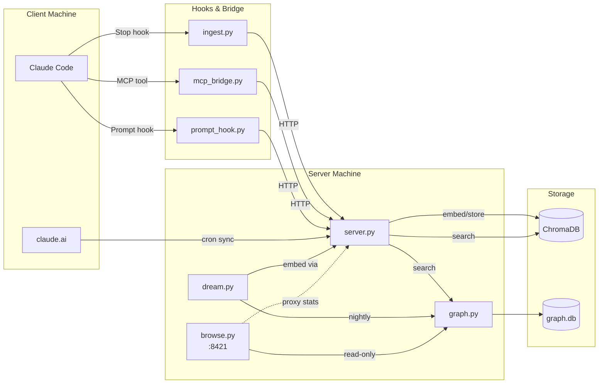
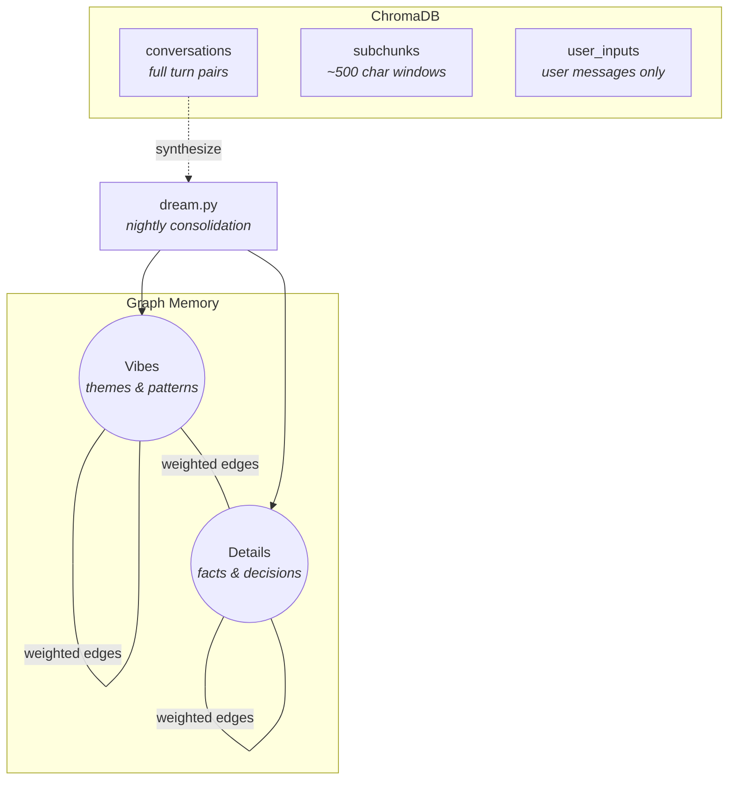

# memory-server

Persistent conversation memory for Claude Code. Embeds conversation transcripts into a vector store, searchable via MCP tools. Includes a graph-based long-term memory layer that consolidates raw conversations into synthesized knowledge.

> **Note**: This project is fully vibe coded. Trust accordingly.

> **Security**: This server has no authentication and is designed to run on a trusted private network (e.g. a direct ethernet link or isolated LAN). Do not expose it to the internet. The memory store contains sensitive personal data — treat it like an unencrypted diary. PRs adding auth are welcome.

## Architecture



The server can run on a separate machine from Claude Code — all communication is over HTTP. The MCP bridge, hooks, and import scripts run on the same machine as Claude Code and proxy requests to the server.

### Storage



All search endpoints apply MMR (Maximal Marginal Relevance, lambda=0.7) for diverse results. Graph search walks the neighborhood; edge weights are adjusted during the dream cycle based on agent reflections on recalled memories.

## Hardware Requirements

The server runs an embedding model ([nomic-embed-text-v1.5](https://huggingface.co/nomic-ai/nomic-embed-text-v1.5)) locally. It can run on modest hardware — an old desktop or a Raspberry Pi 5 will work.

| Component | Minimum | Recommended |
|---|---|---|
| RAM | 4 GB | 8+ GB |
| CPU | Any x86_64 / ARM64 | 4+ cores |
| GPU | None (CPU works) | Any CUDA GPU with compute capability 7.0+ |
| Disk | 2 GB | 10+ GB (scales with conversation history) |
| Python | 3.10 | 3.12 or 3.13 |

**GPU notes**: A CUDA-capable GPU (RTX 20-series or newer) speeds up embedding ~5-10x but is not required. Older GPUs (GTX 900/1000 series) won't work with current PyTorch — use `EMBED_DEVICE=cpu` instead. On Apple Silicon Macs, use `EMBED_DEVICE=mps` for hardware-accelerated embedding. The graph layer and ChromaDB are CPU-only regardless.

**Separate machine**: The server is designed to run on a dedicated machine (even an old one gathering dust) so embedding doesn't compete with your dev workload. A direct ethernet cable or LAN connection to your dev machine is all you need. It also works fine on the same machine if you prefer — this is the typical setup on macOS.

## Setup — Server

### 1. Install dependencies

```bash
cd ~/memory-server
python -m venv .venv
source .venv/bin/activate
pip install -e .
```

Requires Python 3.10+. If your system Python is too new for ChromaDB's dependencies, use [pyenv](https://github.com/pyenv/pyenv) to install a compatible version (3.12 or 3.13 recommended).

### 2. Run the server

```bash
python server.py
```

The server binds to `0.0.0.0:8420` by default. ChromaDB persists to `~/.memory-server/chromadb`, graph to `~/.memory-server/graph.db`.

### 3. Memory Browser UI (optional)

A read-only web UI for exploring the graph. Runs as a separate lightweight process — no embedding model loaded.

```bash
python browse.py
```

Binds to `0.0.0.0:8421`. Open `http://your-server:8421` to browse. Four tabs:

- **Graph** — Cytoscape.js force-directed layout of all nodes and edges. Click a node to see its text, metadata, and neighbors.
- **Recalls** — Recent memory injections with reflections. Filter by session ID.
- **Stats** — Node/edge counts, reflection distribution, and ChromaDB collection sizes (proxied from the main server). Reflection timeline charts support **markers** — dashed vertical annotations for tracking the impact of changes over time.
- **Dreams** — Live view of dream pipeline runs. Shows consolidation/reconsolidation status, operation counts, and per-operation detail.

Create a marker via the server API:

```bash
curl -X POST http://your-server:8420/graph/marker \
  -H 'Content-Type: application/json' \
  -d '{"label": "min_sim 0.65"}'
```

### 4. Run as a service

#### macOS (launchd)

Create `~/Library/LaunchAgents/com.memory-server.plist`:

```xml
<?xml version="1.0" encoding="UTF-8"?>
<!DOCTYPE plist PUBLIC "-//Apple//DTD PLIST 1.0//EN" "http://www.apple.com/DTDs/PropertyList-1.0.dtd">
<plist version="1.0">
<dict>
    <key>Label</key>
    <string>com.memory-server</string>

    <key>ProgramArguments</key>
    <array>
        <string>/path/to/memory-server/.venv/bin/python</string>
        <string>server.py</string>
    </array>

    <key>WorkingDirectory</key>
    <string>/path/to/memory-server</string>

    <key>EnvironmentVariables</key>
    <dict>
        <key>EMBED_DEVICE</key>
        <string>mps</string>
        <key>BIND_HOST</key>
        <string>127.0.0.1</string>
    </dict>

    <key>RunAtLoad</key>
    <true/>

    <key>KeepAlive</key>
    <true/>

    <key>StandardOutPath</key>
    <string>/Users/YOU/.memory-server/server.log</string>
    <key>StandardErrorPath</key>
    <string>/Users/YOU/.memory-server/server.log</string>
</dict>
</plist>
```

Set `EMBED_DEVICE` to `mps` on Apple Silicon Macs, or `cpu` on Intel Macs. Set `BIND_HOST` to `127.0.0.1` when running everything on the same machine (the default `0.0.0.0` listens on all interfaces).

Load and start:

```bash
launchctl load ~/Library/LaunchAgents/com.memory-server.plist
```

The service starts automatically on login (`RunAtLoad`) and restarts on crash (`KeepAlive`). Logs go to `~/.memory-server/server.log`.

To stop/start manually:

```bash
launchctl unload ~/Library/LaunchAgents/com.memory-server.plist

launchctl load ~/Library/LaunchAgents/com.memory-server.plist
```

For the browse UI, create `~/Library/LaunchAgents/com.memory-server.browse.plist`:

```xml
<?xml version="1.0" encoding="UTF-8"?>
<!DOCTYPE plist PUBLIC "-//Apple//DTD PLIST 1.0//EN" "http://www.apple.com/DTDs/PropertyList-1.0.dtd">
<plist version="1.0">
<dict>
    <key>Label</key>
    <string>com.memory-server.browse</string>

    <key>ProgramArguments</key>
    <array>
        <string>/path/to/memory-server/.venv/bin/python</string>
        <string>browse.py</string>
    </array>

    <key>WorkingDirectory</key>
    <string>/path/to/memory-server</string>

    <key>EnvironmentVariables</key>
    <dict>
        <key>BROWSE_HOST</key>
        <string>127.0.0.1</string>
    </dict>

    <key>RunAtLoad</key>
    <true/>

    <key>KeepAlive</key>
    <true/>

    <key>StandardOutPath</key>
    <string>/Users/YOU/.memory-server/browse.log</string>
    <key>StandardErrorPath</key>
    <string>/Users/YOU/.memory-server/browse.log</string>
</dict>
</plist>
```

```bash
launchctl load ~/Library/LaunchAgents/com.memory-server.browse.plist
```

#### Linux (systemd)

```bash
mkdir -p ~/.config/systemd/user

cat > ~/.config/systemd/user/memory-server.service << 'EOF'
[Unit]
Description=Memory Server (embedding + vector store)
After=network.target

[Service]
Type=simple
WorkingDirectory=%h/memory-server
ExecStart=%h/memory-server/.venv/bin/python server.py
Restart=always
RestartSec=5

[Install]
WantedBy=default.target
EOF

systemctl --user daemon-reload
systemctl --user enable --now memory-server
```

Enable lingering so the service starts at boot:

```bash
sudo loginctl enable-linger $USER
```

The server uses CUDA by default. If your GPU is older (CUDA compute capability below 7.0, e.g. GTX 900 series or earlier), add `Environment=EMBED_DEVICE=cpu` to the service file. CPU embedding is slower but works fine.

For the browse UI:

```bash
cat > ~/.config/systemd/user/memory-browse.service << 'EOF'
[Unit]
Description=Memory Browser (graph web UI)
After=memory-server.service

[Service]
Type=simple
WorkingDirectory=%h/memory-server
ExecStart=%h/memory-server/.venv/bin/python browse.py
Restart=always
RestartSec=5

[Install]
WantedBy=default.target
EOF

systemctl --user daemon-reload
systemctl --user enable --now memory-browse
```

## Setup — Client Machine

If the server runs on a different machine, set `MEMORY_SERVER_URL` to point at it (e.g. `http://192.168.1.100:8420`). If it's the same machine, the default `http://localhost:8420` works.

### 1. Install MCP bridge dependencies

```bash
pip install -e .[bridge]
```

### 2. Register the MCP server

Add to `~/.claude.json`:

```json
{
  "mcpServers": {
    "memory": {
      "command": "python",
      "args": ["/path/to/memory-server/mcp_bridge.py"],
      "env": {"MEMORY_SERVER_URL": "http://your-server:8420"}
    }
  }
}
```

### 3. Configure hooks

Add to `~/.claude/settings.json`:

```json
{
  "hooks": {
    "Stop": [
      {
        "hooks": [
          {
            "type": "command",
            "command": "MEMORY_SERVER_URL=http://your-server:8420 python /path/to/memory-server/ingest.py"
          }
        ]
      }
    ],
    "UserPromptSubmit": [
      {
        "hooks": [
          {
            "type": "command",
            "command": "MEMORY_SERVER_URL=http://your-server:8420 python /path/to/memory-server/prompt_hook.py"
          }
        ]
      }
    ]
  }
}
```

### 4. Agent instructions and permissions

The prompt hook injects graph memories with a recall ID. For the feedback loop to work, the agent needs instructions to reflect on them and permission to do so without prompting.

Add to your global `~/.claude/CLAUDE.md`:

```markdown
## Memory Reflections

When graph memories are injected via the prompt hook, reflect on them using the
`reflect` MCP tool. Do this once per turn, after reading the memories
but before responding to the user.

The prompt hook output includes a recall ID. Pass it back with one reflection
code per memory, in order:

    recall_id:U,I,N,N,M

Codes:
- U (USED) — directly informed your response
- I (INTERESTING) — didn't use it, but it added context or shaped your understanding
- N (NOISE) — irrelevant to what's happening
- D (DISTRACTING) — irrelevant and got in the way
- M (MISLEADING) — wrong or outdated, actively harmful to have seen
```

#### `/memories` skill (optional)

Symlink the skill into your Claude skills directory so users can browse injected memories:

```bash
mkdir -p ~/.claude/skills/memories
ln -s /path/to/memory-server/skills/memories/SKILL.md ~/.claude/skills/memories/SKILL.md
```

Then type `/memories` in Claude Code to see the last injection, or `/memories 3` for the last 3.

Auto-allow the reflection tool in `~/.claude/settings.json` so the agent doesn't prompt on every turn:

```json
{
  "permissions": {
    "allow": [
      "mcp__memory__reflect"
    ]
  }
}
```

### 5. Backfill historical conversations

```bash
MEMORY_SERVER_URL=http://your-server:8420 python batch_import.py
```

Options:

```
--project syneme      Filter by project name substring
--include-subagents   Also ingest subagent transcripts
--dry-run             Show what would be ingested
--reset               Clear tracking and re-ingest everything
--batch-size 50       Chunks per request (default: 50)
```

## Claude.ai Conversation Sync

Pulls conversations from the Claude web/mobile interface into the memory server. Runs as an hourly cron job on the server machine.

### Setup

```bash
pip install -e .[sync]
playwright install chromium
```

### Initial login

Requires a display (X forwarding works):

```bash
python claude_sync.py login
```

Log into claude.ai via Google SSO in the browser that opens, then close it. The session is saved to `~/.claude-sync/browser-profile/`.

### Cron entry

```
0 * * * * cd ~/memory-server && .venv/bin/python claude_sync.py sync
```

Logs go to `~/.claude-sync/sync.log`. When the session expires (~monthly), re-run the login step.

## Graph Memory — Dream Pipeline

The dream pipeline consolidates raw conversations into graph nodes using the Claude CLI (requires `claude` to be installed and authenticated).

```bash
# Consolidate all un-dreamed conversations into graph nodes
python dream.py consolidate

# Limit to last 7 days only
python dream.py consolidate --days 7

# Process rated recalls (adjust edge weights, reconsolidate embeddings)
python dream.py reconsolidate

# Full cycle: consolidate + reconsolidate
python dream.py full

# View graph statistics
python dream.py stats
```

Chunks are marked after processing — re-running won't reprocess already-consolidated chunks.

### Scheduling

The dream pipeline uses `claude -p` (the Claude CLI in non-interactive mode) for synthesis. Make sure `claude` is installed and authenticated on the machine (`claude login`).

Set the `CLAUDE_CLI` environment variable to the full path of the `claude` binary. This is required for scheduled execution because launchd and cron don't inherit your shell's PATH. Find it with `which claude`.

#### macOS (launchd)

Create `~/Library/LaunchAgents/com.memory-server.dream.plist`:

```xml
<?xml version="1.0" encoding="UTF-8"?>
<!DOCTYPE plist PUBLIC "-//Apple//DTD PLIST 1.0//EN" "http://www.apple.com/DTDs/PropertyList-1.0.dtd">
<plist version="1.0">
<dict>
    <key>Label</key>
    <string>com.memory-server.dream</string>

    <key>ProgramArguments</key>
    <array>
        <string>/path/to/memory-server/.venv/bin/python</string>
        <string>dream.py</string>
        <string>full</string>
    </array>

    <key>WorkingDirectory</key>
    <string>/path/to/memory-server</string>

    <key>EnvironmentVariables</key>
    <dict>
        <key>MEMORY_SERVER_URL</key>
        <string>http://localhost:8420</string>
        <key>CLAUDE_CLI</key>
        <string>/opt/homebrew/bin/claude</string>
    </dict>

    <key>StartCalendarInterval</key>
    <dict>
        <key>Hour</key>
        <integer>4</integer>
        <key>Minute</key>
        <integer>0</integer>
    </dict>

    <key>StandardOutPath</key>
    <string>/Users/YOU/.memory-server/dream.log</string>
    <key>StandardErrorPath</key>
    <string>/Users/YOU/.memory-server/dream.log</string>
</dict>
</plist>
```

Update the `CLAUDE_CLI` path — it's `/opt/homebrew/bin/claude` on Apple Silicon Macs (Homebrew default) or `/usr/local/bin/claude` on Intel Macs.

```bash
launchctl load ~/Library/LaunchAgents/com.memory-server.dream.plist
```

The dream runs daily at 4:00 AM. Unlike the server/browse agents, it has no `KeepAlive` — it runs once and exits. To trigger a manual run:

```bash
launchctl start com.memory-server.dream
```

Check logs at `~/.memory-server/dream.log`.

#### Linux (cron)

```
0 4 * * * cd ~/memory-server && CLAUDE_CLI=/usr/local/bin/claude .venv/bin/python dream.py full >> ~/.memory-server/dream.log 2>&1
```

## Deployment

On macOS with everything running locally, just `git pull` and reload the launchd agents:

```bash
launchctl unload ~/Library/LaunchAgents/com.memory-server.plist
launchctl load ~/Library/LaunchAgents/com.memory-server.plist

launchctl unload ~/Library/LaunchAgents/com.memory-server.browse.plist
launchctl load ~/Library/LaunchAgents/com.memory-server.browse.plist
```

The dream agent picks up code changes on its next scheduled run — no reload needed.

If the server runs on a separate Linux machine, sync code changes with rsync:

```bash
rsync -avz --exclude=__pycache__ --exclude=.pytest_cache --exclude='*.pyc' \
  --exclude=.venv --exclude=.git \
  /path/to/memory-server/ user@server:~/memory-server/
```

A convenience script is provided: `./deploy.sh [--restart]`. Copy `.env.example` to `.env` and fill in your deployment details.

## Running Tests

```bash
pip install -e .[dev]
pytest -v
```

Tests spin up isolated instances with temporary storage — no effect on production data.

## Verification

```bash
# Check stats
curl http://your-server:8420/stats

# Search conversations
curl "http://your-server:8420/search?q=parsing&k=3"

# Search subchunks
curl -X POST http://your-server:8420/search_subchunks \
  -H "Content-Type: application/json" \
  -d '{"q": "parsing", "k": 3}'

# Search graph memory
curl -X POST http://your-server:8420/search_graph \
  -H "Content-Type: application/json" \
  -d '{"q": "code complexity", "k": 5}'
```

## Environment Variables

| Variable | Default | Used by |
|---|---|---|
| `MEMORY_SERVER_URL` | `http://localhost:8420` | mcp_bridge.py, ingest.py, prompt_hook.py, batch_import.py, dream.py |
| `BIND_HOST` | `0.0.0.0` | server.py |
| `BIND_PORT` | `8420` | server.py |
| `CHROMA_DIR` | `~/.memory-server/chromadb` | server.py |
| `INCOMING_DIR` | `~/.memory-server/incoming` | server.py |
| `GRAPH_DB_PATH` | `~/.memory-server/graph.db` | graph.py |
| `EMBED_MODEL` | `nomic-ai/nomic-embed-text-v1.5` | server.py |
| `EMBED_DEVICE` | `cuda` | server.py — `mps` for Apple Silicon Macs, `cpu` for Intel Macs or older CUDA GPUs (compute capability < 7.0) |
| `WORKER_INTERVAL` | `2.0` | server.py |
| `MEMORY_DISTANCE_THRESHOLD` | `0.5` | prompt_hook.py |
| `MEMORY_MAX_RESULTS` | `5` | prompt_hook.py |
| `CLAUDE_CLI` | `claude` | dream.py — full path to the Claude CLI binary (e.g. `/opt/homebrew/bin/claude`). Required for launchd/cron which don't inherit shell PATH |
| `DREAM_MODEL` | `sonnet` | dream.py |
| `SIMILARITY_THRESHOLD` | `0.85` | dream.py |
| `REFLECTION_SCALE` | `0.02` | dream.py — multiplier for reflection-driven edge weight changes |
| `BROWSE_HOST` | `0.0.0.0` | browse.py |
| `BROWSE_PORT` | `8421` | browse.py |
| `SURPRISAL_GATE` | `0` | prompt_hook.py — `0` = log-only, `1` = enforce gate |
| `SURPRISAL_GENERAL_THRESHOLD` | `6.0` | surprisal.py — minimum general surprisal to consider substantive |
| `SURPRISAL_PERSONAL_THRESHOLD` | `12.0` | surprisal.py — maximum personal surprisal to consider familiar |

## Troubleshooting

### Server segfaults on startup (ChromaDB HNSW index corruption)

If the server crashes with a segfault (exit code 139, stack trace in `chromadb_rust_bindings`), the HNSW index files are corrupted but the data in SQLite is intact. This can happen if multiple processes open the same ChromaDB directory concurrently.

**Fix**: Delete the binary index directories and let ChromaDB rebuild them from the WAL on next startup.

```bash
# Stop the server
# macOS:
launchctl unload ~/Library/LaunchAgents/com.memory-server.plist
# Linux:
systemctl --user stop memory-server

# Identify collection UUID directories
sqlite3 ~/.memory-server/chromadb/chroma.sqlite3 \
  "select s.id, c.name from segments s join collections c on s.collection=c.id where s.scope='VECTOR';"

# Remove the index directory for affected collection(s)
rm -rf ~/.memory-server/chromadb/<uuid-from-above>

# Restart — ChromaDB rebuilds the index automatically
# macOS:
launchctl load ~/Library/LaunchAgents/com.memory-server.plist
# Linux:
systemctl --user start memory-server
```

Rebuild time depends on collection size. No data is lost.

Ref: [ChromaDB Cookbook — Rebuilding](https://cookbook.chromadb.dev/strategies/rebuilding/)

### Clean re-ingest (last resort)

Only if the SQLite data itself is corrupted or collections need schema changes:

```bash
rm -rf ~/.memory-server/chromadb
rm -f ~/.memory-server/ingested_sessions.json
# Restart the server (macOS: unload/load the plist, Linux: systemctl --user restart memory-server)
MEMORY_SERVER_URL=http://your-server:8420 python batch_import.py --reset
```

This destroys all chunk data and re-ingests from JSONL transcripts. It takes a long time and should only be used when targeted repair isn't possible.

## How It Works

**Ingestion**: The Stop hook fires after each Claude response. It reads the hook context from stdin (transcript path), extracts the latest user/assistant turn pair, and POSTs it to the server. The server embeds the text with nomic-embed-text-v1.5 (using the `search_document:` task prefix) and stores it in three collections: the full turn pair, 500-char subchunks, and the user message alone.

**Search**: The MCP bridge exposes `search_memory` (coarse, full turn pairs), `search_memory_detail` (fine, ~500-char subchunks), `search_memory_graph` (synthesized long-term memories), and `list_recalls` (view injected memories and reflections for a session). All vector search uses MMR re-ranking for diversity.

**Prompt hook**: Fires on UserPromptSubmit. Searches user_inputs and graph memory, injects compact hints so Claude knows what's relevant without fetching full context. Each graph search creates a recall with a unique ID. These hints are private to the agent — the user doesn't see them.

**Reflections**: The agent reflects on each recalled memory (U/I/N/D/M) using the `reflect` MCP tool. Reflections are stored on the recall and drive edge weight adjustments during the next dream cycle. Unreflected recalls have no effect — only explicit reflections change the graph. Users can inspect injected memories and their reflections via the `/memories` skill (or the `list_recalls` MCP tool directly).

**Surprisal gate**: The prompt hook uses word-level surprisal to decide whether a query is worth running through memory retrieval. It computes mean surprisal against two unigram frequency tables: a **general English** corpus (289k words from [wordfreq](https://github.com/rspeer/wordfreq), which merges Reddit, Twitter, Wikipedia, and web crawl data) and a **personal corpus** built from the user's own conversation history. Retrieval fires when general surprisal is high (substantive, technical content — not filler like "hi how are you") AND personal surprisal is low (familiar topic — memories likely exist). This skips ~58% of queries that would otherwise return only noise.

The personal corpus builds automatically — every ingested conversation updates word frequency counts. **The gate needs a few weeks of conversation history to calibrate well.** With a fresh install, leave `SURPRISAL_GATE=0` (log-only mode, the default) until you have enough personal corpus data. You can monitor gate decisions in the browse UI — each recall shows its general and personal surprisal scores and the gen/pers ratio. Once you're satisfied the gate is making good decisions, set `SURPRISAL_GATE=1` to enforce it.

To bootstrap the personal corpus from existing data, run `backfill_word_counts.py` after initial setup:

```bash
MEMORY_SERVER_URL=http://your-server:8420 python backfill_word_counts.py
```

The general English frequency table also needs a one-time load. The backfill script handles both — it requires the `wordfreq` package (`pip install wordfreq`).

**Dream pipeline**: Nightly consolidation reads recent conversations, synthesizes them into graph nodes (vibes and details) via Claude CLI, and connects them with weighted edges. Reconsolidation processes reflected recalls — adjusting edge weights by `reflection_value * cosine_similarity * REFLECTION_SCALE` — then blends node embeddings with their neighbors and re-synthesizes stale text descriptions.
