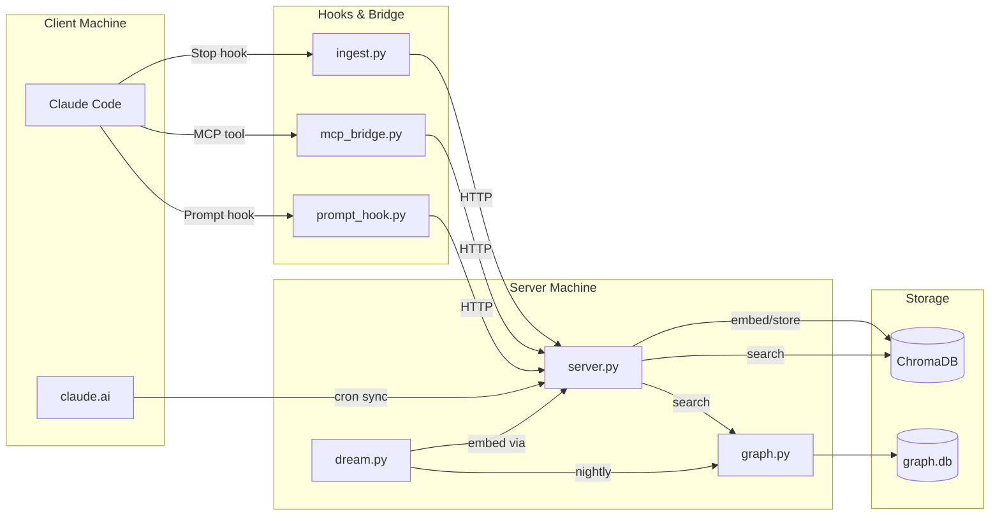
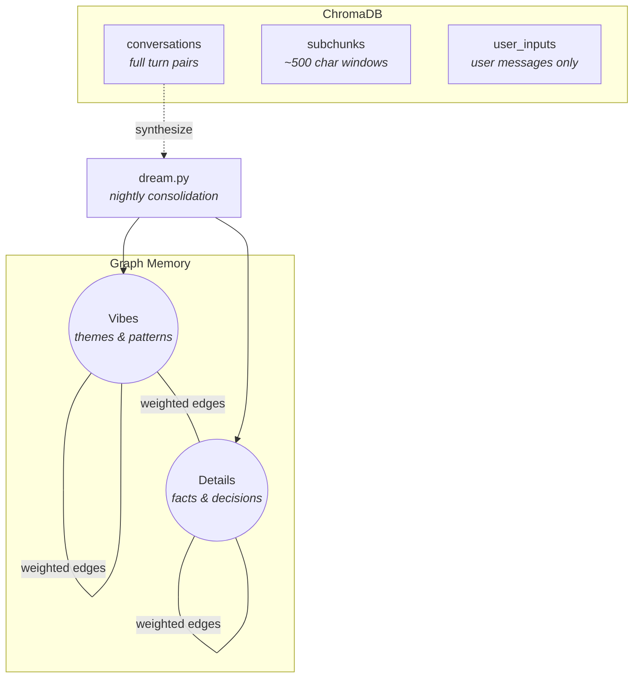

# memory-server

Persistent conversation memory for Claude Code. Embeds conversation transcripts into a vector store, searchable via MCP tools. Includes a graph-based long-term memory layer that consolidates raw conversations into synthesized knowledge.

> **Note**: This project is fully vibe coded. Trust accordingly.

> **Security**: This server has no authentication and is designed to run on a trusted private network (e.g. a direct ethernet link or isolated LAN). Do not expose it to the internet. The memory store contains sensitive personal data — treat it like an unencrypted diary. PRs adding auth are welcome.

## Architecture



The server can run on a separate machine from Claude Code — all communication is over HTTP. The MCP bridge, hooks, and import scripts run on the same machine as Claude Code and proxy requests to the server.

### Storage



All search endpoints apply MMR (Maximal Marginal Relevance, lambda=0.7) for diverse results. Graph search walks the neighborhood and strengthens traversed edges — retrieval itself reinforces associations for the next dream cycle.

## Hardware Requirements

The server runs an embedding model ([nomic-embed-text-v1.5](https://huggingface.co/nomic-ai/nomic-embed-text-v1.5)) locally. It can run on modest hardware — an old desktop or a Raspberry Pi 5 will work.

| Component | Minimum | Recommended |
|---|---|---|
| RAM | 4 GB | 8+ GB |
| CPU | Any x86_64 / ARM64 | 4+ cores |
| GPU | None (CPU works) | Any CUDA GPU with compute capability 7.0+ |
| Disk | 2 GB | 10+ GB (scales with conversation history) |
| Python | 3.10 | 3.12 or 3.13 |

**GPU notes**: A CUDA-capable GPU (RTX 20-series or newer) speeds up embedding ~5-10x but is not required. Older GPUs (GTX 900/1000 series) won't work with current PyTorch — use `EMBED_DEVICE=cpu` instead. The graph layer and ChromaDB are CPU-only regardless.

**Separate machine**: The server is designed to run on a dedicated machine (even an old one gathering dust) so embedding doesn't compete with your dev workload. A direct ethernet cable or LAN connection to your dev machine is all you need. It also works fine on the same machine if you prefer.

## Setup — Server Machine

### 1. Install dependencies

```bash
cd ~/memory-server
python -m venv .venv
source .venv/bin/activate
pip install -e .
```

Requires Python 3.10+. If your system Python is too new for ChromaDB's dependencies, use [pyenv](https://github.com/pyenv/pyenv) to install a compatible version (3.12 or 3.13 recommended).

### 2. Run the server

```bash
python server.py
```

The server binds to `0.0.0.0:8420` by default. ChromaDB persists to `~/.memory-server/chromadb`, graph to `~/.memory-server/graph.db`.

### 3. (Optional) systemd service

```bash
mkdir -p ~/.config/systemd/user

cat > ~/.config/systemd/user/memory-server.service << 'EOF'
[Unit]
Description=Memory Server (embedding + vector store)
After=network.target

[Service]
Type=simple
WorkingDirectory=%h/memory-server
ExecStart=%h/memory-server/.venv/bin/python server.py
Restart=always
RestartSec=5

[Install]
WantedBy=default.target
EOF

systemctl --user daemon-reload
systemctl --user enable --now memory-server
```

Enable lingering so the service starts at boot:

```bash
sudo loginctl enable-linger $USER
```

The server uses CUDA by default. If your GPU is older (CUDA compute capability below 7.0, e.g. GTX 900 series or earlier), add `Environment=EMBED_DEVICE=cpu` to the service file. CPU embedding is slower but works fine.

## Setup — Client Machine

If the server runs on a different machine, set `MEMORY_SERVER_URL` to point at it (e.g. `http://192.168.1.100:8420`). If it's the same machine, the default `http://localhost:8420` works.

### 1. Install MCP bridge dependencies

```bash
pip install -e .[bridge]
```

### 2. Register the MCP server

Add to `~/.claude.json`:

```json
{
  "mcpServers": {
    "memory": {
      "command": "python",
      "args": ["/path/to/memory-server/mcp_bridge.py"],
      "env": {"MEMORY_SERVER_URL": "http://your-server:8420"}
    }
  }
}
```

### 3. Configure hooks

Add to `~/.claude/settings.json`:

```json
{
  "hooks": {
    "Stop": [
      {
        "hooks": [
          {
            "type": "command",
            "command": "MEMORY_SERVER_URL=http://your-server:8420 python /path/to/memory-server/ingest.py"
          }
        ]
      }
    ],
    "UserPromptSubmit": [
      {
        "hooks": [
          {
            "type": "command",
            "command": "MEMORY_SERVER_URL=http://your-server:8420 python /path/to/memory-server/prompt_hook.py"
          }
        ]
      }
    ]
  }
}
```

### 4. Backfill historical conversations

```bash
MEMORY_SERVER_URL=http://your-server:8420 python batch_import.py
```

Options:

```
--project syneme      Filter by project name substring
--include-subagents   Also ingest subagent transcripts
--dry-run             Show what would be ingested
--reset               Clear tracking and re-ingest everything
--batch-size 50       Chunks per request (default: 50)
```

## Claude.ai Conversation Sync

Pulls conversations from the Claude web/mobile interface into the memory server. Runs as an hourly cron job on the server machine.

### Setup

```bash
pip install -e .[sync]
playwright install chromium
```

### Initial login

Requires a display (X forwarding works):

```bash
python claude_sync.py login
```

Log into claude.ai via Google SSO in the browser that opens, then close it. The session is saved to `~/.claude-sync/browser-profile/`.

### Cron entry

```
0 * * * * cd ~/memory-server && .venv/bin/python claude_sync.py sync
```

Logs go to `~/.claude-sync/sync.log`. When the session expires (~monthly), re-run the login step.

## Graph Memory — Dream Pipeline

The dream pipeline consolidates raw conversations into graph nodes using the Claude CLI (requires `claude` to be installed and authenticated).

```bash
# Consolidate all un-dreamed conversations into graph nodes
python dream.py consolidate

# Limit to last 7 days only
python dream.py consolidate --days 7

# Process activated edges (boost weights, reconsolidate embeddings)
python dream.py reconsolidate

# Full cycle: consolidate + reconsolidate
python dream.py full

# View graph statistics
python dream.py stats
```

Chunks are marked after processing — re-running won't reprocess already-consolidated chunks.

### Scheduling

The dream pipeline uses `claude -p` (the Claude CLI in non-interactive mode) for synthesis. Make sure `claude` is installed and authenticated on the server machine (`claude login`).

Run nightly via cron:

```
0 4 * * * cd ~/memory-server && .venv/bin/python dream.py full >> ~/.claude-sync/dream.log 2>&1
```

## Deployment

If the server runs on a separate machine, sync code changes with rsync:

```bash
rsync -avz --exclude=__pycache__ --exclude=.pytest_cache --exclude='*.pyc' \
  --exclude=.venv --exclude=.git \
  /path/to/memory-server/ user@server:~/memory-server/
```

A convenience script is provided: `./deploy.sh [--restart]`. Copy `.env.example` to `.env` and fill in your deployment details.

## Running Tests

```bash
pip install -e .[dev]
pytest test_server.py test_graph.py -v
```

Tests spin up isolated instances with temporary storage — no effect on production data.

## Verification

```bash
# Check stats
curl http://your-server:8420/stats

# Search conversations
curl "http://your-server:8420/search?q=parsing&k=3"

# Search subchunks
curl -X POST http://your-server:8420/search_subchunks \
  -H "Content-Type: application/json" \
  -d '{"q": "parsing", "k": 3}'

# Search graph memory
curl -X POST http://your-server:8420/search_graph \
  -H "Content-Type: application/json" \
  -d '{"q": "code complexity", "k": 5}'
```

## Environment Variables

| Variable | Default | Used by |
|---|---|---|
| `MEMORY_SERVER_URL` | `http://localhost:8420` | mcp_bridge.py, ingest.py, prompt_hook.py, batch_import.py, dream.py |
| `BIND_HOST` | `0.0.0.0` | server.py |
| `BIND_PORT` | `8420` | server.py |
| `CHROMA_DIR` | `~/.memory-server/chromadb` | server.py |
| `INCOMING_DIR` | `~/.memory-server/incoming` | server.py |
| `GRAPH_DB_PATH` | `~/.memory-server/graph.db` | graph.py |
| `EMBED_MODEL` | `nomic-ai/nomic-embed-text-v1.5` | server.py |
| `EMBED_DEVICE` | `cuda` | server.py — set to `cpu` for older GPUs (compute capability < 7.0) |
| `WORKER_INTERVAL` | `2.0` | server.py |
| `MEMORY_DISTANCE_THRESHOLD` | `0.5` | prompt_hook.py |
| `MEMORY_MAX_RESULTS` | `5` | prompt_hook.py |
| `DREAM_MODEL` | `sonnet` | dream.py |
| `SIMILARITY_THRESHOLD` | `0.85` | dream.py |

## How It Works

**Ingestion**: The Stop hook fires after each Claude response. It reads the hook context from stdin (transcript path), extracts the latest user/assistant turn pair, and POSTs it to the server. The server embeds the text with nomic-embed-text-v1.5 (using the `search_document:` task prefix) and stores it in three collections: the full turn pair, 500-char subchunks, and the user message alone.

**Search**: The MCP bridge exposes `search_memory` (coarse, full turn pairs), `search_memory_detail` (fine, ~500-char subchunks), and `search_memory_graph` (synthesized long-term memories). All vector search uses MMR re-ranking for diversity.

**Prompt hook**: Fires on UserPromptSubmit. Searches user_inputs and graph memory, injects compact hints so Claude knows what's relevant without fetching full context. These hints are private to the agent — the user doesn't see them.

**Dream pipeline**: Nightly consolidation reads recent conversations, synthesizes them into graph nodes (vibes and details) via Claude CLI, and connects them with weighted edges. Reconsolidation boosts frequently-traversed edges, blends node embeddings with their neighbors, and re-synthesizes stale text descriptions.
